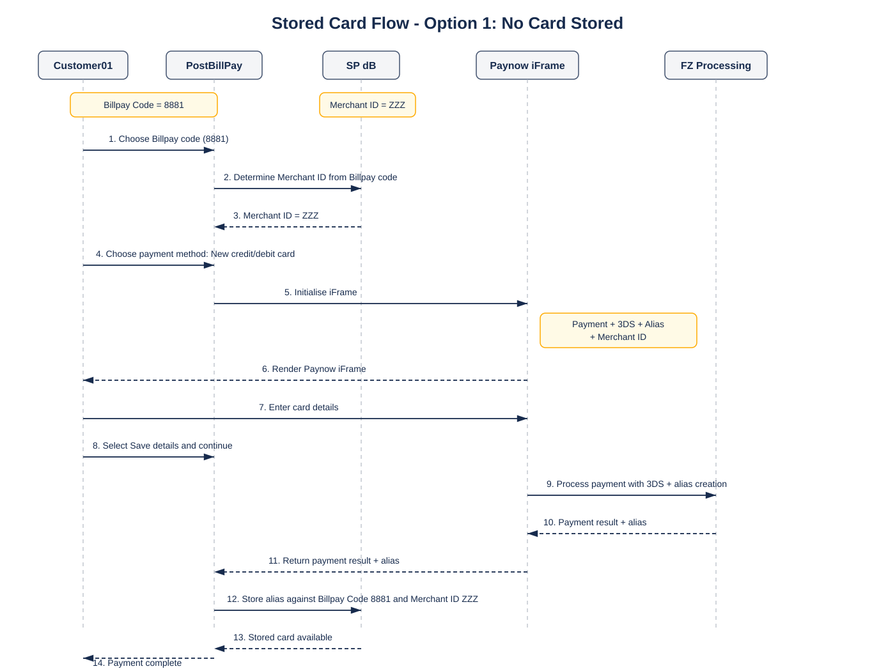
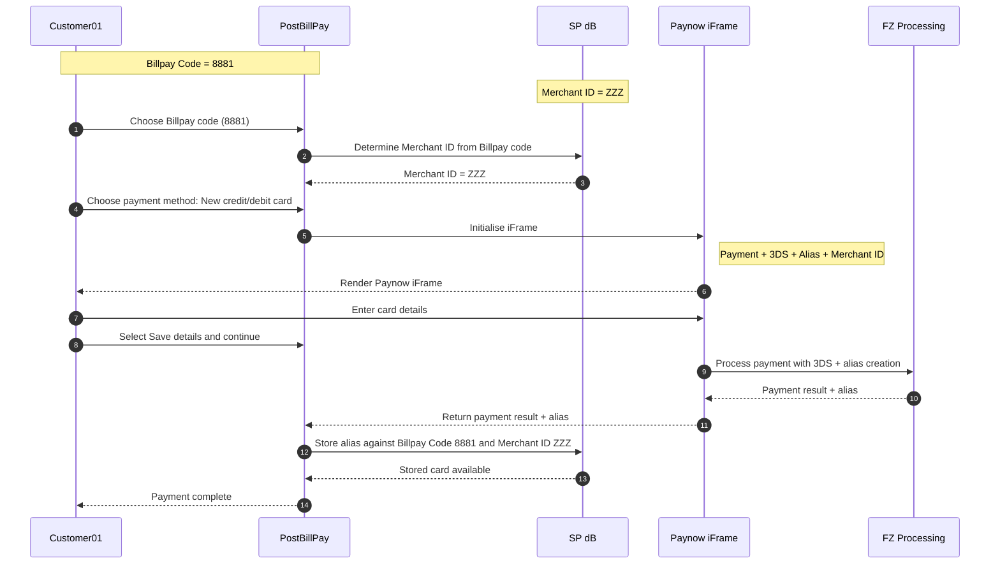

# PostBillPay Stored Card Flows

This folder contains sequence diagrams for PostBillPay payment flows.

## Option 1 — No Card Stored

A customer enters a new credit/debit card, selects to save details in PostBillPay, the payment is processed by FZ Processing, and the returned alias is stored in SP dB against Billpay Code `8881` and Merchant ID `ZZZ`.

## Rendered Diagram

## Mermaid Source

## Source Files

- Mermaid source: [`stored-card-option1.mmd`](./stored-card-option1.mmd)
- Rendered SVG: [`stored-card-option1.svg`](./stored-card-option1.svg)
